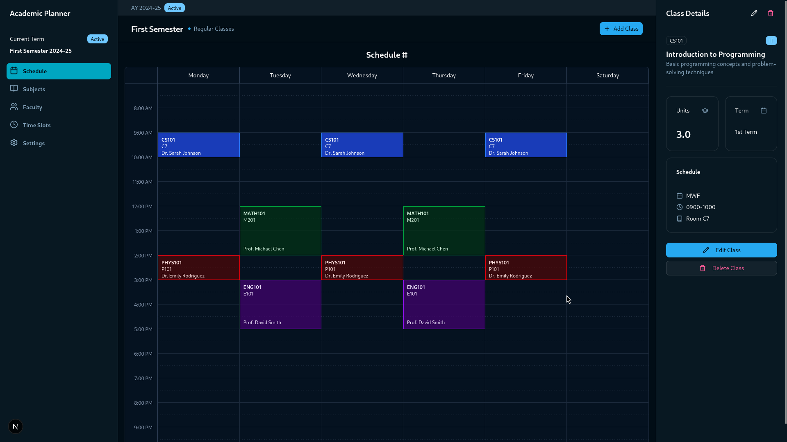

<div align="center">
  
  
  # Oras
  
  A modern, responsive application for creating beautiful class schedule timetables with AI-powered image recognition capabilities.
</div>



## Overview

Oras is a Next.js application designed to help students and educators create, view, and manage class schedules with an intuitive, visually appealing interface. The application renders complex schedules in an elegant grid layout, optimized for both desktop and mobile viewing.

## Features

- **Beautiful Timetable Visualization**: Display your schedule in a visually stunning, color-coded grid that makes it easy to view at a glance
- **Responsive Design**: Optimized for all devices from desktop to mobile
- **AI-Powered Schedule Generation**: Upload an image of your schedule and let our AI generate a complete timetable automatically
- **Multiple Schedule Management**: Create and switch between different schedule configurations
- **Class Details**: View comprehensive information about each class by clicking on its block

## Technology Stack

- **Frontend**: Next.js 14, React, TypeScript
- **Styling**: Tailwind CSS
- **AI Processing**: Advanced computer vision and OCR technology
- **Deployment**: Vercel

## Getting Started

### Prerequisites

- Node.js 18.17 or later
- npm, yarn, or pnpm

### Installation

1. Clone the repository:
   ```bash
   git clone https://github.com/generyand/oras.git
   cd timetable-visualizer
   ```

2. Install dependencies:
   ```bash
   npm install
   # or
   yarn install
   # or
   pnpm install
   ```

3. Run the development server:
   ```bash
   npm run dev
   # or
   yarn dev
   # or
   pnpm dev
   ```

4. Open [http://localhost:3000](http://localhost:3000) in your browser to see the application.

## Usage

### Creating a Timetable Manually

1. Navigate to the "New Schedule" section
2. Add classes with their details (code, title, instructor, time, location, etc.)
3. Choose a color for each class for better visual organization
4. Save your schedule

### Generating a Timetable from an Image

Our innovative AI feature allows you to create a timetable by simply uploading an image:

1. Click on the "Generate from Image" button
2. Upload a photo or screenshot of your printed/digital schedule
3. Wait while our AI processes the image and extracts the schedule information
4. Review the generated timetable and make any necessary adjustments
5. Save your new schedule

The AI can recognize various schedule formats from university portals, screenshots, or even photos of printed schedules.

## Mobile Experience

The application is fully optimized for mobile devices, with a responsive design that adapts to different screen sizes:

- Compact day headers
- Optimized time labels
- Touch-friendly class blocks
- Intuitive mobile navigation

## Contributing

Contributions are welcome! Please feel free to submit a Pull Request.

1. Fork the repository
2. Create your feature branch (`git checkout -b feature/amazing-feature`)
3. Commit your changes (`git commit -m 'Add some amazing feature'`)
4. Push to the branch (`git push origin feature/amazing-feature`)
5. Open a Pull Request

## License

This project is licensed under the MIT License - see the LICENSE file for details.

## Acknowledgments

- Inspired by the need for more intuitive and visually appealing schedule management
- Special thanks to all contributors who have helped shape this project
